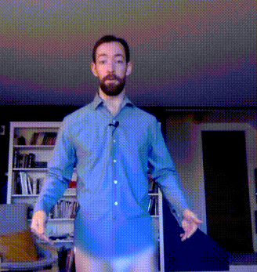

## Pants filter

### Add pants or blur out everything from the waist down for extra safety on Zoom calls.

View a demo and more background on the project at https://youtu.be/ZHQ4XACBUqo

The pants filter uses [OpenCV](https://github.com/opencv/opencv-python) and MediaPipe's [Pose detection](https://google.github.io/mediapipe/solutions/pose.html) to add a real-time pants filter to video input. The result is piped to a virtual camera output using [pyvirtualcam](https://github.com/letmaik/pyvirtualcam).

To use the resulting output, you must have a virtual camera device. The easiest way to do this on any OS is to download and install [OBS](https://obsproject.com/), open it up, then click "Start Virtual Camera" on the bottom right. You can now close OBS for good. With the pants filter running, select "OBS Virtual Camera" as your video source in Zoom/Teams/etc.

**Hit the `p` key on the preview window to toggle your pants among ten different styles, included in the `pants` folder as a standard PNG template.**

Hit `ESC` on the preview window to exit the pants filter, or `CTRL+C` to close the Python process.

Optional flags:

- `--help` - Display the below options
- `--input` - Choose a camera or video file path (defaults to device `0`)
- `--pants` - Draw pants by default, instead of only blurring
- `--width` - Proportional width of pants beyond mid-leg width (defaults to `0.4`)
- `--flip` - Flip along the y-axis for selfie view
- `--landmarks` - Draw detected body landmarks from MediaPipe
- `--record` - Write the output to a timestamped AVI recording in the current folder

Example usage:

- `python pantser.py -h` - Show all argument options
- `python pantser.py --input 2 --pants 1 --width .6 --flip 1 --landmarks 1 --record 1` - Camera device 2; slightly wider hips; flip the image; draw landmarks; generate a recording
- `python pantser.py -i "/Downloads/shakira.mp4" -w .9` - Use video file as input; extra hips